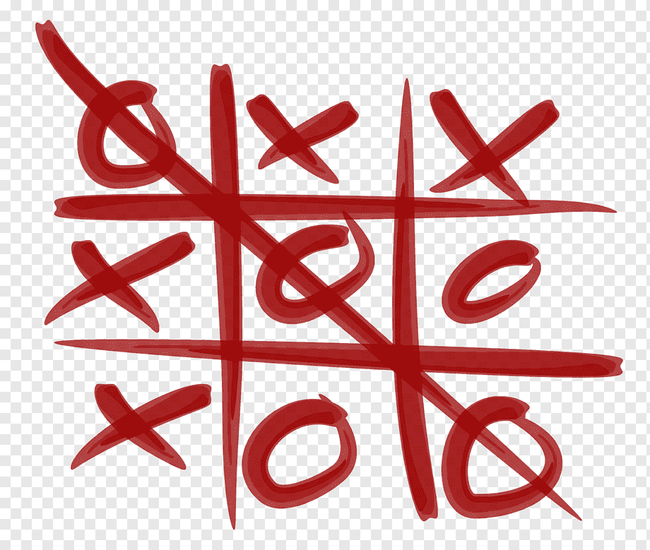
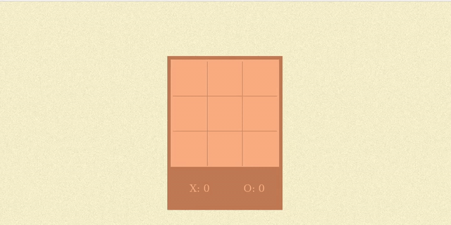

# TICTACTOE 
<h2>TICTACTOE GAME DEVELOPED IN JAVASCRIPT </h1>
 

 
 
 

## HOW TO INIT THE APPLICATION

In the terminal, clone the project

~~~shell
git clone https://github.com/lucas-andrad/tictactoe.git
~~~

Before, enter in the folder

~~~shell
cd tictactoe
~~~

Finally, open the index.html file.

 

## CONTRIBUTORS 

 

[    Lucas Andrade ](https://github.com/lucas-andrad) |
| :---: |  

 

[    Arthur Sena ](https://github.com/senaarth) |
| :---: |  